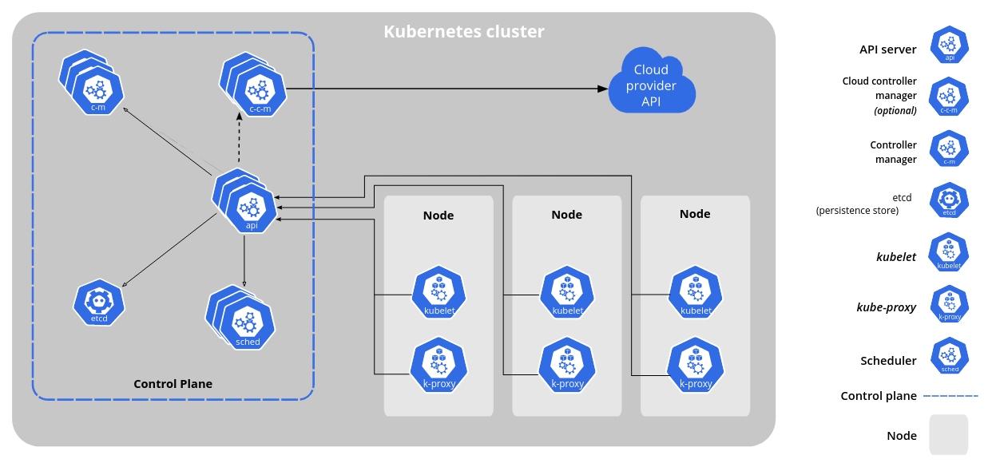

# Kubernetes Learning

[**Kubernetes Tutorial for Beginners [FULL COURSE in 4 Hours]**](https://www.youtube.com/watch?v=X48VuDVv0do&t=490s&ab_channel=TechWorldwithNana)\
[**TechWorld with Nana - Basic Kubernetes Demo**](https://gitlab.com/nanuchi/youtube-tutorial-series/-/tree/master)

## What is Kubernetes?

- [**Kubernetes**](https://kubernetes.io/), also known as K8s, is an open-source system for automating deployment, scaling, and management of containerized applications.
- Developed by Google
- Helps you manage containeried applications in different deployment environments (physical, virtual, cloud, hybrid...)

### What problems does Kubernetes solve?

#### What are the tasks of an orchestration tool?

The need for a container orchestration tool

- Trend from [**Monolith**](https://microservices.io/patterns/monolithic.html) to [**Miroservices**](https://microservices.io/)
- Increased usage of [**Containers**](https://www.docker.com/resources/what-container/)
- Demand for a proper way of managing those hundreds of containers

#### What feature do orchestration tool offer?

- **High Availability** or no downtime
- **Scalability** or high performance
- **Disaster Recovery** - backup and restore

## K8s Components explained

https://kubernetes.io/docs/concepts/overview/components/

